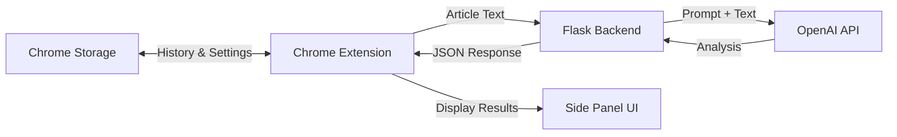

# Media Bias Analyzer (v2.0)


## Overview

The **Media Bias Analyzer** is a Chrome extension designed to provide users with comprehensive and nuanced analysis of online news articles. It leverages a Flask backend and the OpenAI GPT-4o API to evaluate various aspects of an article, helping users understand the underlying bias, context, and framing of the news content they consume.

Version 2.0 introduces significant improvements including a side panel interface, history tracking, settings management, and customizable AI prompts, making it easier than ever for users to critically assess media coverage.



## Features

### Core Analysis Features

- **Comprehensive Article Analysis**: In-depth assessment of media bias and contextual information
- **Bias Score Meter**: Visual representation of bias on a scale from -5 (left-leaning) to +5 (right-leaning)
- **Analysis Summary**: Subjective overview of the article's bias (liberal, conservative, or neutral)
- **Historical Context**: Background information to help understand the article's subject matter
- **Content Summary**: Concise presentation of the article's key points and takeaways
- **Language Tone Analysis**: Assessment of the language and tone used in the article
- **Framing Perspective**: Analysis of how the article frames its topic or argument
- **Alternative Perspectives**: Additional viewpoints that may be missing from the original article
- **Publisher Bias**: Information about the publisher's historical leaning or typical bias

### UI Features

- **Side Panel Interface**: Uses Chrome's side panel API for a more spacious and comprehensive display
- **Expandable Sections**: Collapsible content areas to prevent information overload
- **Bias Meter Visualization**: Gradient bar with arrow indicator showing the article's position on the political spectrum
- **Loading Indicator**: Spinner and progress updates during analysis processing
- **Modern Design**: Clean, blue-based color scheme with consistent visual language

### Data Management Features

- **History Tracking**: Save and display previously analyzed articles with favicon and metadata
- **History Management**: Delete individual entries or clear all history
- **Settings Framework**: Infrastructure for user configuration options
- **Customizable AI Prompt**: Edit individual sections or the complete prompt used for analysis
- **Client-side Prompt Storage**: Saves customized prompts using Chrome storage

## Screenshots

*[Screenshots would be added here]*

## Installation

### Prerequisites

- Python 3.7 or higher
- Google Chrome Browser
- OpenAI API Key
- Node.js and npm (optional, for development purposes)

### Backend Setup

1. **Clone the Repository**
   ```bash
   git clone https://github.com/yourusername/media-bias-analyzer.git
   cd media-bias-analyzer
   ```

2. **Navigate to the Backend Directory**
   ```bash
   cd media-bias-backend
   ```

3. **Create a Virtual Environment**
   ```bash
   python -m venv venv
   ```

4. **Activate the Virtual Environment**
   - On Windows:
     ```bash
     venv\Scripts\activate
     ```
   - On macOS/Linux:
     ```bash
     source venv/bin/activate
     ```

5. **Install Dependencies**
   ```bash
   pip install -r requirements.txt
   ```

6. **Set Up Environment Variables**
   - Create a `.env` file in the `media-bias-backend` directory
   - Add your OpenAI API key:
     ```
     OPENAI_API_KEY=your-openai-api-key-here
     ```

7. **Run the Backend Server**
   ```bash
   python app.py
   ```
   The server will run on http://127.0.0.1:5000 by default.

### Extension Setup

1. **Open Chrome and Navigate to Extensions**
   - Go to `chrome://extensions/`
   - Enable Developer mode (toggle in the top-right corner)

2. **Load the Extension**
   - Click "Load unpacked"
   - Select the root directory of the cloned repository (containing manifest.json)

3. **Verify Installation**
   - The Media Bias Analyzer icon should appear in your Chrome toolbar
   - Click the icon to open the side panel

## Usage

### Analyzing an Article

1. **Navigate to a News Article** in Chrome
2. **Open the Side Panel** by clicking the Media Bias Analyzer icon
3. **Click the "Analyze" Button** to process the current article
4. **View the Results** in the side panel, including:
   - Bias score meter
   - Analysis summary
   - Context and content summary
   - Language tone and framing perspective
   - Alternative perspectives and publisher bias

### Using the History Feature

1. **Access History** by clicking the settings icon and selecting "History"
2. **Browse Previous Analyses** listed with article title, favicon, and date
3. **View Past Analysis** by clicking on a history entry
4. **Manage History** using the three-dots menu to delete entries or clear all history

### Customizing Settings

1. **Access Settings** by clicking the settings icon
2. **View AI Bias Prompt** to see and edit the prompt used for analysis
3. **Access History** to view previously analyzed articles

### Editing the AI Prompt

1. **Access Prompt Editor** via Settings > View AI Bias Prompt
2. **Edit Individual Sections** including:
   - Role
   - Context
   - Overall Bias Score
   - Language and Tone
   - Framing and Perspective
   - Alternative Perspectives
   - Task
3. **Use Advanced Settings** to edit the entire prompt directly
4. **Save Changes** automatically or manually with the Save button
5. **Reset to Default** if needed

## Architecture

### System Components

1. **Chrome Extension (Client)**
   - **Content Script**: Extracts article text from web pages
   - **Background Script**: Manages side panel behavior
   - **Extension UI**: Displays analysis results in a side panel
   - **Chrome Storage API**: Persists analysis history and settings

2. **Flask Backend (Server)**
   - **Flask Application**: Handles HTTP requests from the extension
   - **Analysis Logic**: Prepares prompts and processes responses

3. **OpenAI API**
   - **GPT-4o Model**: Performs the actual analysis of article text

### Data Flow

1. **Article Text Extraction**
   - User navigates to a news article
   - User clicks extension icon to open side panel
   - User clicks "Analyze" button
   - Content script extracts article text and metadata
   - Data is sent to background script

2. **Analysis Request**
   - Background script forwards article text to Flask backend
   - Flask backend constructs a prompt with the article text
   - Prompt is sent to OpenAI API

3. **Analysis Processing**
   - OpenAI API processes the prompt and returns analysis
   - Flask backend parses and formats the response
   - Formatted analysis is returned to the extension

4. **Results Display**
   - Extension receives analysis data
   - UI renders the bias meter and analysis sections
   - Results are stored in Chrome storage for history

### Technical Implementation

- **Chrome Side Panel API**: Used instead of a popup for more screen real estate
- **Event-Driven Architecture**: Uses event listeners for user interactions
- **Asynchronous Operations**: Handles API calls and UI updates asynchronously
- **JSON Data Format**: All communication between components uses JSON
- **Local Storage**: Uses Chrome's storage API for history and settings

## Project Structure

```
media-bias-analyzer/
├── media-bias-backend/
│   ├── app.py                 # Flask application and API endpoints
│   ├── requirements.txt       # Python dependencies
│   └── .env                   # Environment variables (not in repo)
├── icons/
│   ├── icon16.png             # Extension icon (16x16)
│   ├── icon48.png             # Extension icon (48x48)
│   ├── icon128.png            # Extension icon (128x128)
│   ├── logoHero.svg           # Logo used in the header
│   ├── settings.svg           # Settings icon
│   └── three-dots-menu.svg    # Menu icon for history entries
├── manifest.json              # Extension manifest file
├── popup.html                 # Main HTML for the side panel UI
├── popup.css                  # Styles for the side panel UI
├── popup.js                   # Main JavaScript for the UI functionality
├── contentScript.js           # Script that runs in the context of web pages
├── background.js              # Background script for extension functionality
└── README.md                  # Project documentation
```

## Current Status

### What Works

- **Core Functionality**
  - Article analysis with a single click
  - Bias detection on a -5 to +5 scale
  - Comprehensive insights with multiple dimensions
  - Side panel UI with modern design

- **User Interface**
  - Bias meter with gradient and arrow indicator
  - Expandable sections for content organization
  - Loading indicator with progress updates
  - Responsive layout for side panel

- **Data Management**
  - History tracking with article metadata
  - Local storage for persistence
  - History management (delete/clear)
  - Customizable prompt editor

- **Backend Integration**
  - Flask API for processing requests
  - OpenAI GPT-4o integration
  - JSON formatting for data exchange
  - Client-side prompt storage and retrieval

### What's in Development

- **Enhanced Text Extraction**: Improving article content extraction for various website structures
- **Expanded Settings Options**: Implementing user-configurable preferences
- **Export Functionality**: Adding ability to export analysis results or history
- **Error Recovery**: Improving handling of network failures and API issues

## Roadmap

### Short-term Goals

1. **Improve Text Extraction**: Enhance the article content extraction logic
2. **Expand Settings Options**: Implement user-configurable settings such as:
   - Default analysis depth
   - UI theme preferences
   - History retention period
3. **Add Export Functionality**: Allow users to export analysis results or history

### Medium-term Goals

1. **Deploy Backend Server**: Move from local-only backend to a hosted solution
2. **Implement User Accounts**: Optional accounts for syncing history across devices
3. **Add Sentiment Analysis**: Expand analysis to include sentiment metrics
4. **Improve Visualization**: Enhance data visualization for analysis results

### Long-term Vision

1. **Historical Data Tracking**: Track bias patterns across publications over time
2. **Recommendation Engine**: Suggest alternative sources based on analysis
3. **Cross-browser Support**: Expand beyond Chrome to other browsers
4. **Mobile Companion**: Create a mobile app version

## Troubleshooting

### Common Issues

- **Backend Connection Errors**
  - Ensure the Flask server is running at http://127.0.0.1:5000
  - Check for any firewall or network restrictions

- **OpenAI API Issues**
  - Verify your API key is correctly set in the `.env` file
  - Check your OpenAI account for rate limits or billing issues

- **Content Extraction Problems**
  - Some websites may have complex structures that prevent proper extraction
  - Try analyzing articles from major news sources for best results

- **Extension Not Working**
  - Reload the extension from the Chrome extensions page
  - Check the browser console for error messages

### Solutions

- **Restart the Backend Server**: Sometimes simply restarting the Flask server resolves issues
- **Clear Extension Data**: In Chrome settings, you can clear the extension's stored data
- **Update OpenAI Package**: Ensure you're using the latest compatible version
- **Check Console Logs**: Use Chrome's developer tools to check for error messages

## Contributing

Contributions are welcome! To contribute:

1. Fork the Repository
2. Clone Your Fork
3. Create a New Branch
4. Make Your Changes
5. Commit Your Changes
6. Push to Your Fork
7. Create a Pull Request

## License

This project is open source. Feel free to use, modify, and distribute as needed.

## Acknowledgments

- **OpenAI**: For the GPT-4o API used in text analysis
- **Flask**: For providing the web framework
- **Chrome Extensions Documentation**: For guidance on extension development
- **Community Contributors**: For helping improve the project

## Contact

For questions or suggestions, open an issue on the GitHub repository or contact the maintainer at joshua_nelson@ucsb.edu.
